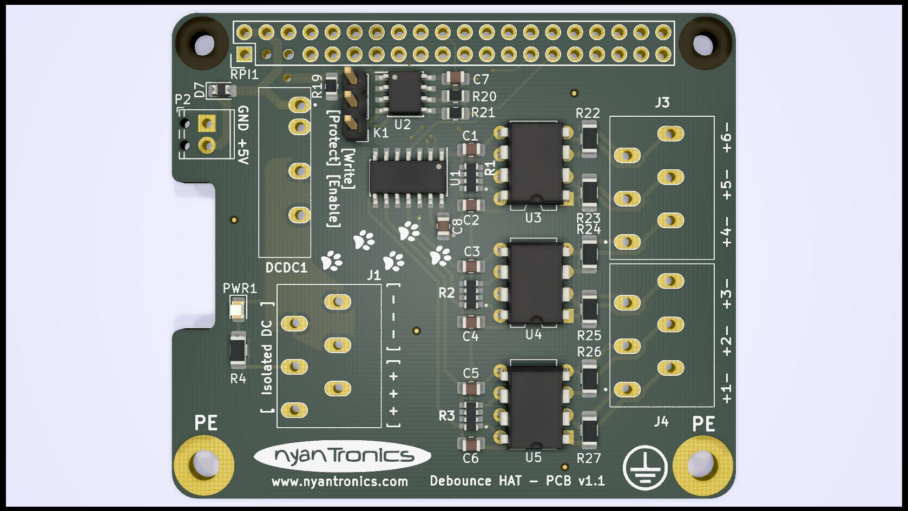
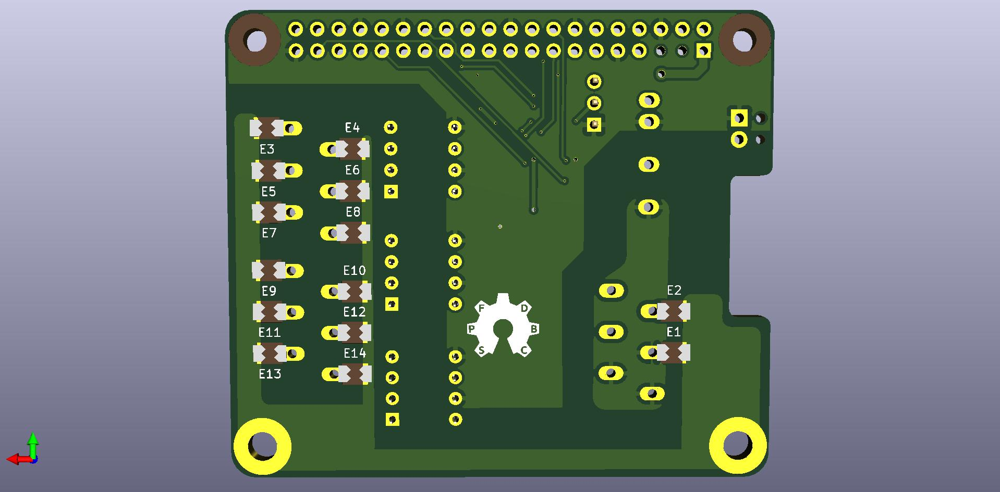

# Debounce HAT for Raspberry Pi #

This project is a HAT extension board for Raspberry Pi-compatible single board computers (SBCs) that allows one to connect both power for the Raspberry Pi SBC and up to six switches or relays. These switches are fully debounced using an RC network and 74LVT04 inverting Schmitt trigger IC. 

The inputs are opto-isolated, with protection against ESD up to about 2 kV (limit of the connector terminals). For improved protection, connect the designated mounting points to earth (PE). 

See the HTML BOM for the values of the individual passive components. The 74LVT04 is in SOIC-14 form factor, as is the CAT24C32 EEPROM IC. The LTV-824 optocouplers are in PDIP format.

The six channels of the board are mapped to the following GPIO pins:

  1. BCM 23 (WiringPi 4)
  2. BCM 26 (25)
  3. BCM 6 (22)
  4. BCM 5 (21)
  5. BCM 22 (3)
  6. BCM 17 (0)

With 5 VDC connected to the two-pole terminal, power is provided to the connected Raspberry Pi board using the GPIO header's 5V pins.

The inputs are driven with an external voltage in the range of 3 to 12V. With mechanical switches, a circuit has to be formed with the isolated DC header, or with an external power supply.

## Notice ##

This board design is currently a work-in-progress and untested. I cannot accept any responsibility for design flaws, but will gladly accept feedback and improvements.

The EEPROM configuration is provided in the `eeprom_setting.txt` file, which can be processed with the `eepmake` tool, and flashed to the EEPROM with `eepflash`. Both tools can be found at [https://github.com/raspberrypi/hats/tree/master/eepromutils](https://github.com/raspberrypi/hats/tree/master/eepromutils "Raspberry Pi HATs Github"). The jumper (three pin header) allows for the EEPROM to be set to write-protected/write-enabled mode (WP, WE, respectively).

**[Warning]** When not flashing the EEPROM, the EEPROM header should be set to Write-Protect (WP) mode by bridging the `[Protect]` and `[Write]` pins on the three-pin header to prevent any accidental rewriting of the EEPROM's contents.

A full BOM will be added as well at some point in the future. For now the notes in the schematic should suffice.