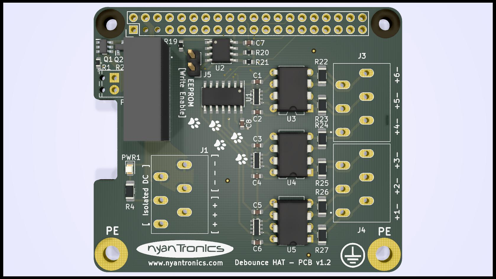
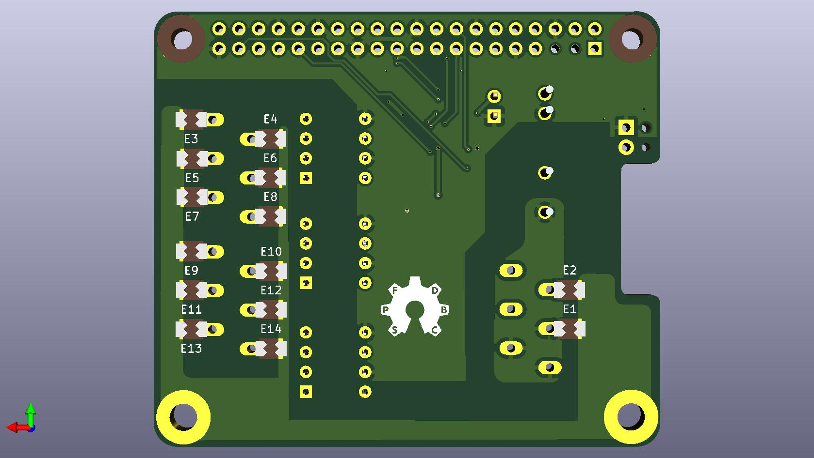

# Debounce HAT for Raspberry Pi #

The Debounce Hat provides three pairs of opto-isolated, debounced digital inputs to a Raspberry Pi-compatible single board computer (SBC).
All inputs accept 3 - 12V with arbitrary polarity and can alternatively be connected to open-collector outputs or mechanical switches leveraging the on-board isolated 5V supply.

A project page for this board along with ordering information can be found on the [Nyantronics site](http://www.nyantronics.com/debounce_hat.php "Debounce HAT on Nyantronics site").

**Features:**
  

-  6 input channels (grouped as 3 pairs).
-  Uncommitted inputs (100V channel-to-channel isolation).
-  2kV AC isolation between pairs (connector limited).
-  5kV AC (8kV HBM) opto-isolation to SBC logic.
-  4kV DC isolated 5V 200mA supply (DCDC converter limited).
-  Two screw mounting points for earth connection.
-  Spark gap overvoltage protection on all isolated connections.
-  2.5mm spring terminals for 0.2-1.0mm² wires (22-16AWG).
-  16 mm PCB height with connectors.
-  JST XH / 0.1" screw terminal for 5V/2A input for 0.14-0.5mm² wires (26-20AWG).
-  Raspberry Pi-compatible mounting hole pattern.
  
**Typical Applications:**

-  Digital inputs with ESD protection.
-  Mechanical switch / interlock inputs.
-  Isolated sensor interface.
-  Isolated DC voltage sensing.

  
See the HTML BOM for the values of the individual passive components. The 74LVT04 is in SOIC-14 form factor, the CAT24C32 EEPROM IC in SOIC-8. The LTV-824 optocouplers are in PDIP format.

## GPIO ##

The six channels of the board are mapped to the following GPIO pins:

  1. BCM 23 (WiringPi 4)
  2. BCM 26 (25)
  3. BCM 6 (22)
  4. BCM 5 (21)
  5. BCM 22 (3)
  6. BCM 17 (0)

In the below graphic those pins are marked in yellow (DBH n):

With 5 VDC connected to the two-pole terminal, power is provided to the connected Raspberry Pi board using the GPIO header's 5V pins.

The inputs are driven with an external voltage in the range of 3 to 12V. With mechanical switches, a circuit has to be formed with the isolated DC header, or with an external power supply.

## Notice ##

This board design is currently a work-in-progress and partially tested. I cannot accept any responsibility for design flaws, but will gladly accept feedback and improvements.

The EEPROM configuration is provided in the `eeprom_setting.txt` file, which can be processed with the `eepmake` tool, and flashed to the EEPROM with `eepflash`. Both tools can be found at [https://github.com/raspberrypi/hats/tree/master/eepromutils](https://github.com/raspberrypi/hats/tree/master/eepromutils "Raspberry Pi HATs Github"). The jumper (two pin header) allows for the EEPROM to be set to write-protected/write-enabled mode (WP, WE, respectively).

**[Note]** When not flashing the EEPROM, the EEPROM header should be set to Write-Protect (WP) mode by removing any electrical connection between the `[Write Enable]` pins on the two-pin header to prevent any accidental rewriting of the EEPROM's contents.