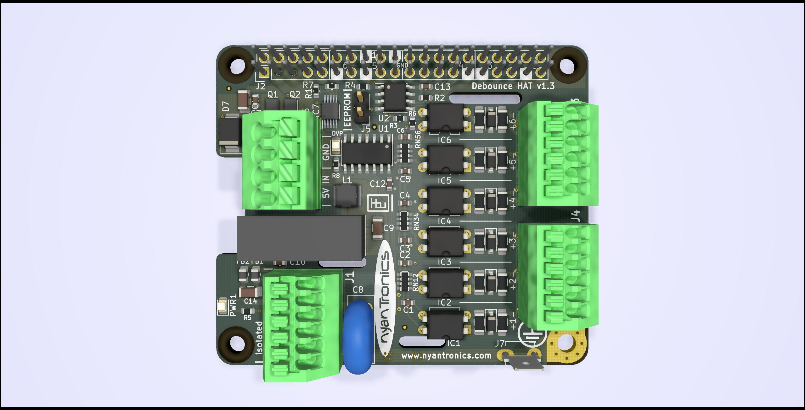
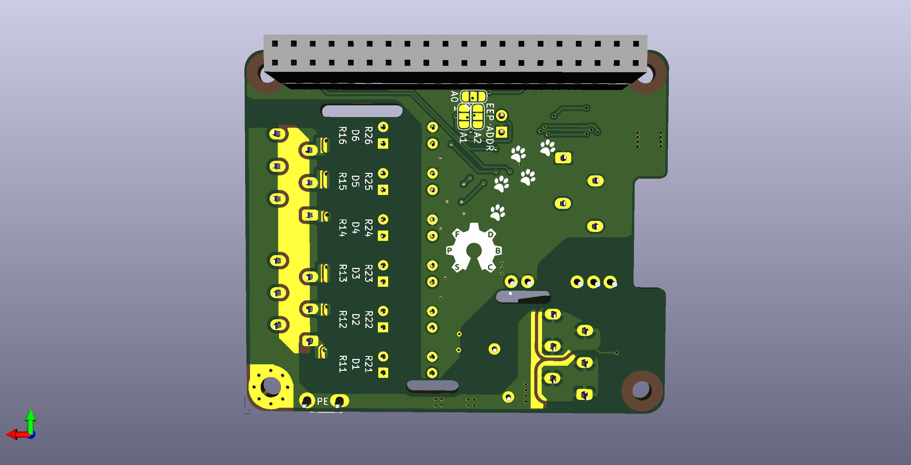
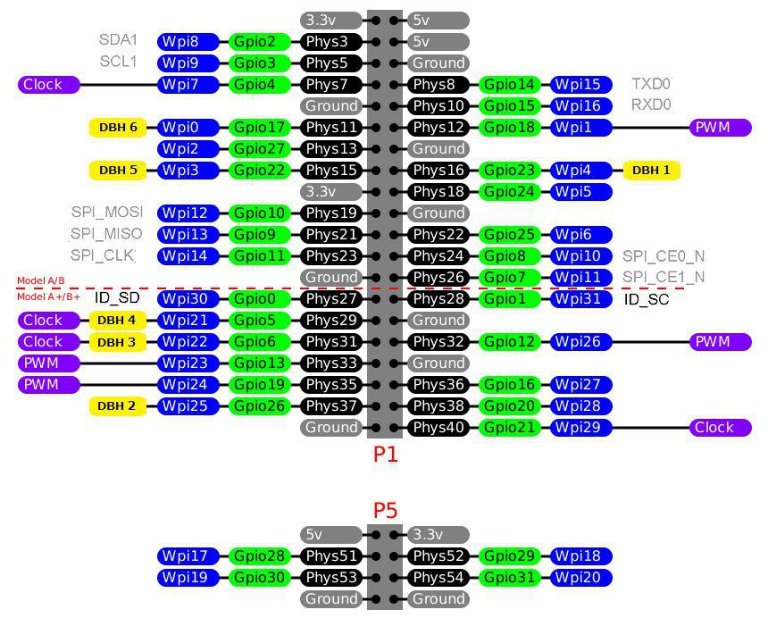

# Debounce HAT for Raspberry Pi #

The Debounce Hat provides six channels of opto-isolated, debounced digital inputs to a Raspberry Pi-compatible single board computer (SBC).
All inputs accept 3 - 24V with arbitrary polarity and can alternatively be connected to open-collector outputs or mechanical switches leveraging the on-board isolated 5V supply.

A project page for this board along with ordering information can be found on the [Nyantronics site](http://www.nyantronics.com/debounce_hat.php "Debounce HAT on Nyantronics site").

**Electrical Specifications:**

-  6  opto-isolated, uncommitted inputs accepting +/- 3..24 V,  with transient voltage protection.
-  Isolated DCDC for 5V 400mA supply for sensors and switches (4 kV DC isolation rating).
-  8 A rated power terminals for easy 5 V supply to additional devices.
-  Active input protection with reverse and overvoltage protection (configured for 5.9 V cut-out).
-  Ideal diode voltage drop below 200 mV at 3 A.
-  &gt;2.4 mm clearance between logic and isolated sides (PE floating).
-  Spark gaps between input pairs.
-  Spark gaps between input pins and PE.
-  Spark gaps between isolated power and PE.
-  Marked pins for input testing.

**Mechanical Specifications:**

- 16 mm PCB stacking height (defined by 2x20 pin 0.1" header).
- Raspberry Pi - compatible mounting hole pattern.
- PE connection via 4.8 mm spade connector and M3 mounting point.
- 3.5 mm pitch terminal block for power in / pass-through (ø 0.2-1.5 mm² / 24-16 AWG).
- 2.5 mm pitch terminal blocks for isolated power and signal (ø 0.2-1.0mm² / 22-16 AWG).
  
**Typical Applications:**

-  Digital inputs with ESD protection.
-  Mechanical switch / interlock inputs.
-  Isolated sensor interface.
-  Isolated DC voltage sensing.

  
See the BOM for the values of the individual passive components. The 74LVT04 is in SOIC-14 form factor, the CAT24C32 EEPROM IC in SOIC-8. The LTV-814 optocouplers are in PDIP format.

## GPIO ##

The six channels of the board are mapped to the following GPIO pins:

  1. BCM 23 (WiringPi 4)
  2. BCM 26 (25)
  3. BCM 6 (22)
  4. BCM 5 (21)
  5. BCM 22 (3)
  6. BCM 17 (0)

In the below graphic those pins are marked in yellow (DBH n):

These pins are also marked on the silkscreen of the PCB.

### External power ###

With 5 VDC connected to the four-pole terminal, power is provided to the connected Raspberry Pi board using the GPIO header's 5V pins.

### Inputs ###

The inputs are driven with an external voltage in the range of 3 to 24V. With mechanical switches, a circuit has to be formed with the isolated DC header, or with an external power supply.

## Notice ##

This board design is still a work-in-progress and partially tested. I cannot accept any responsibility for design flaws, but will gladly accept feedback and improvements.

The EEPROM configuration is provided in the `eeprom_setting.txt` file, which can be processed with the `eepmake` tool, and flashed to the EEPROM with `eepflash`. Both tools can be found at [https://github.com/raspberrypi/hats/tree/master/eepromutils](https://github.com/raspberrypi/hats/tree/master/eepromutils "Raspberry Pi HATs Github"). The jumper (two pin header) allows for the EEPROM to be set to write-protected/write-enabled mode (WP, WE, respectively).

**[Note]** When not flashing the EEPROM, the EEPROM header should be set to Write-Protect (WP) mode by removing any electrical connection between the `[Write Enable]` pins on the two-pin header to prevent any accidental rewriting of the EEPROM's contents.