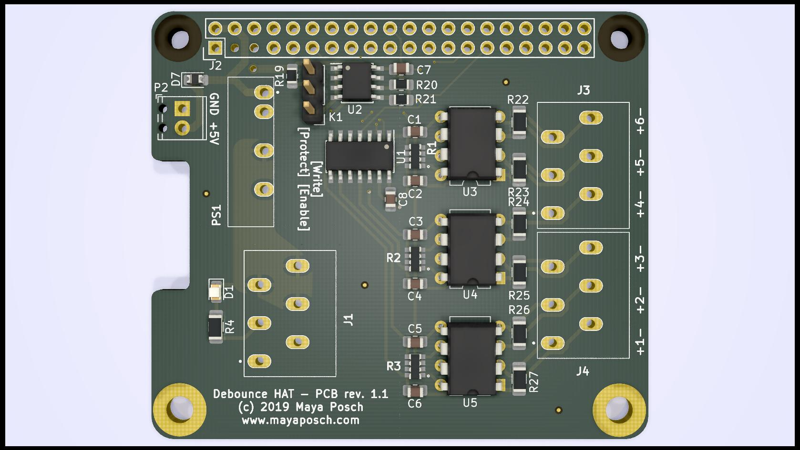

# Debounce HAT for Raspberry Pi #

This project is a simple Hat for Raspberry Pi boards that allows one to connect both power for the Raspberry Pi SBC and up to six switches or relays. These switches are fully debounced using an RC network and 40106 (4000 CMOS) inverse Schmitt trigger IC. 

See the KiCad schematic for the values of the resistors (3.9k, 22k, 39k & 12k) and capacitors (1 uF). These parts are all 0805 form factor. The 40106 is in SOIC-14 form factor, as is the CAT24C32 EEPROM IC.

The six channels of the board are mapped to the following GPIO pins:

  1. BCM 23 (WiringPi 4)
  2. BCM 26 (25)
  3. BCM 6 (22)
  4. BCM 5 (21)
  5. BCM 22 (3)
  6. BCM 17 (0)

When 5 VDC is connected to the two-pole terminal, it provides the connected Raspberry Pi board with power using the 5V pins.

## Notice ##

This board design is currently a work-in-progress and untested. I cannot accept any responsibility for design flaws, but will gladly accept feedback and improvements.

The EEPROM configuration is provided in the `eeprom_setting.txt` file, which can be processed with the `eepmake` tool, and flashed to the EEPROM with `eepflash`. Both tools can be found at [https://github.com/raspberrypi/hats/tree/master/eepromutils](https://github.com/raspberrypi/hats/tree/master/eepromutils "Raspberry Pi HATs Github"). The jumper (three pin header) allows for the EEPROM to be set to write-protected/write-enabled mode (WP, WE, respectively).

**[Warning]** When not flashing the EEPROM, the EEPROM header should be set to `WP` to prevent any accidental rewriting of the EEPROM's contents.

A full BOM will be added as well at some point in the future. For now the notes in the schematic should suffice.